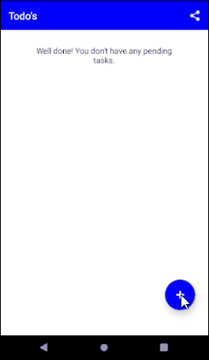
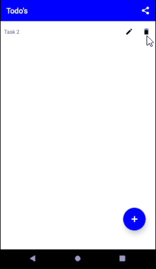

# TODO's

Simple todo's application using firebase, where you can share your key with your friends and see their list.

You can download the APK <a href="./todo-firebase-793a61043fd3404aa8ccb066cb69d55c-signed.apk" download>here</a> or scan the QR code found [here](https://expo.io/@chiefbark/todo-firebase) if you are an android user.




If you want to download this proyect, follow the next steps.

## REQUIREMENTS

- **Node 12** or grater. You can download it from [here](https://nodejs.org/en/download/).
- **expo-cli**. Install it by running the command `npm install -g expo-cli`.

## SETUP	

Clone the repositor to your computer
<br>
`git clone https://github.com/Chiefbark/RN-ToDo-s.git`

Install all the dependencies of the project
<br>
`npm install`

Open the file `src/firebase/index.js` and replace the code with the credentials of your **firebase realtime database**.
```
const firebaseConfig = {
	apiKey: "apiKey",
	authDomain: "authDomain",
	databaseURL: "databaseURL",
	storageBucket: "storageBucket"
};
```

&#9888; **IMPORTANT:** Apply this rules to the firebase realtime database so everybody can write. The application does not provide an authentication method.
```
{
	"rules": {
		".read": true,
		".write": true
	}
}
```

Now you can run the project with `npm start` to start the local development server of Expo CLI.

## LICENSE

This project is licensed under MIT License.

## CONTRIBUTORS

| **Jorge Chércoles Moreno** |
| :-: |
|  |
| <a href="http://github.com/Chiefbark" target="_blank">`github.com/Chiefbark`</a> |